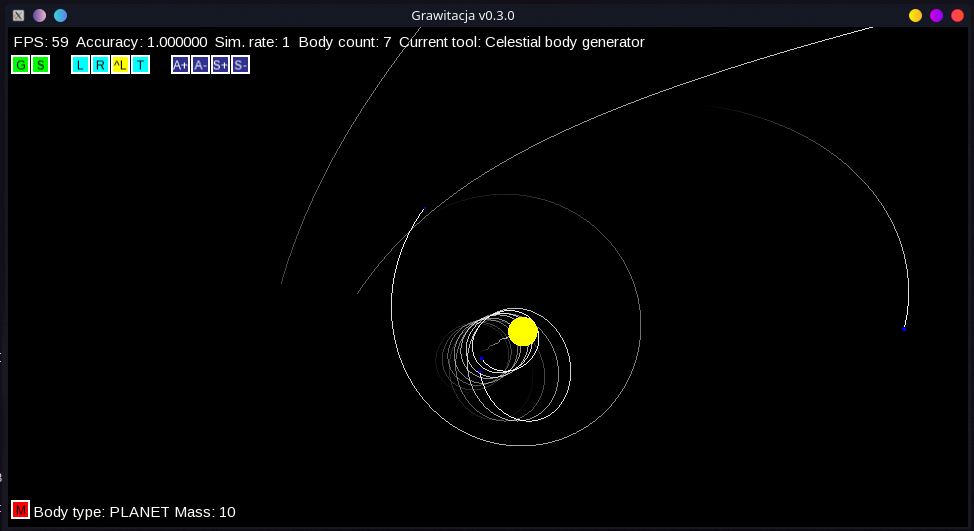

# Gravity
Simplistic, yet fully featured, simulator of gravity between celestial bodies, including stars, planets and asteroids.
SFML, C++11.

## Goals and capabilities of the program
* Realtime simulation of celestial bodies in a multi-bodied system, including stars, planets and asteroids
* Adding new celestial bodies, ad hoc, with spatial and dynamic properties given by mouse clicks.
* Handling collisions of celestial bodies:
	* merging
	* bouncing
	* hybrid
* Deletion of celestial bodies
* Differentiating between different planet types and different star spectral types
* Control of both the pace and accuracy of the simulation
* A special mode made for entertainment purposes: controlling a spaceship

## Building instructions
### Library dependencies
* SFML (graphics, window and system modules)
### Tools required
* Cmake
* C++17 compiler with RTTI
### Instruction
In order to compile the program, please ensure that the SFML library is installed in your system and that you have all the necessary tools like Cmake and a compiler.

Run cmake to generate the build files for your setup (I personally recommend using Cmake GUI).
Please note that static linking will not be available in all setups.

After obtaining the build files, use your toolchain of choice to compile the program.
(eg. run `make` if you are using Unix Makefiles or MinGW Makefiles)

An executable called "Gravity" will appear in the root directory of the project

### Note
I'd be very welcome if you could report any problems with the Cmake script that you encounter.

## Purpose of the project
* Gaining experience in practial usage of object-oriented programming in C++, including virtual methods and inheritance.
* Excercise in using C++'s `std::` containers.
* Fluency in working with smart pointers (`std::unique_ptr<>`).
* Learning how to create simple & interactive GUI applications in SFML.
* Creating a simple toy which helps to understand how orbital mechanics works.
* Gaining experience in drawing graphics and managing windows in the SFML library.
* Getting familiar with Git and GitHub; excercise cooperation.
* Learning how to optimize
* Excercise C++ generic programming
* Optimization via efficient multithreaded programming
* Gaining some experience with cmake-scripts

## Implementation notes
The whole program is based upon the SFML library and its' object-oriented design.
The main function manages the main window by receiving its' events and passing them further or processing them. The `Simulator` object livies within the scope of the main function. 
Every cycle of refreshing the window calls the `tick()` method on the simulator to push the simulation forward in time.

Simulator holds a list of smart pointers to `Celestial_body` which can store various types of bodies (all of their types inherit from `Celestial_body` which is an abstract class). 
With current implementation, both collision detection and gravity computation is parallelized using our custom multithreaded algorithm called "Gonghsi" where a job-queue is implemented.

User input is processed by a separate GUI object (an instance of `UI_state`). 
GUI handles mouse and keyboard events and manages its' internal state of widgets called "tools" (eg. celestial body generator, celestial body selector).
## Current completion status
* `Celestial_body` is implemented
* Both `Planet` and `Star` are drafted for further expansion
* `Asteroid`s work
* GUI is stable
	* Green animated text messages appear
	* Switching between UI tools is stable
	* Masterpanel prints stats
	* GUI has buttons with procedurally-generated textures
	* `CB_selector` can select and delete celestial bodies
	* `CB_gen` can add multiple kinds of celestial bodies
* Window refresh cycle (with rendering)
	* Every celestial body is drawn separately
	* Evert celestial body leaves a white trace of its' orbit. The lifetime of the trace can be altered
	* Orbital traces can be switched off or deleted
* The simulation works
	* The code that computes gravity is considered stable
	* A parallelized algorithm allows for efficient collision detection and parallelism of gravity computation
	* Merge collisions are stable; others are considered experimental
	* Simulation pace can be controlled (simulation ticks / window refresh)
	* Simulation accuracy can be altered (simulation time / tick)
* The main window handles scaling and navigation
## To do
* Proper texturing of celestial bodies
* Celestial body track prediction
* Further improve `CB_selector`, `CB_gen` and `UI_masterpanel`
	* More key-bindings
	* Implement a `Textbox` to enter numbers like a celestial body's mass
	* Add dedicated buttons to choose between the types of celestial bodies
	* Implement edition of celestial bodies
	* Print more data in the debug mode
* Implement loading textures in the global resources manager
* Design and implement maneuverable spaceship mode
* Tracing celestial bodies with the camera
* Read/Save the simulator state via a dedicated XML/JSON module
* Quick-saves and restores of the simulator state
* Optimize rendering
## Wuxing
In the `pairalgo` folder, there is a little animation engine called Wuxing. It visualizes how individual-unique-pair iteration algorithms work. It was written to serve as a helper in designing efficient algorithms for calculating the force of gravity between every unique pair of celestial bodies.

It helped in developing the Tianche algorithm.

## To consider

